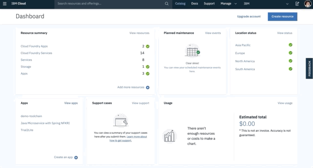
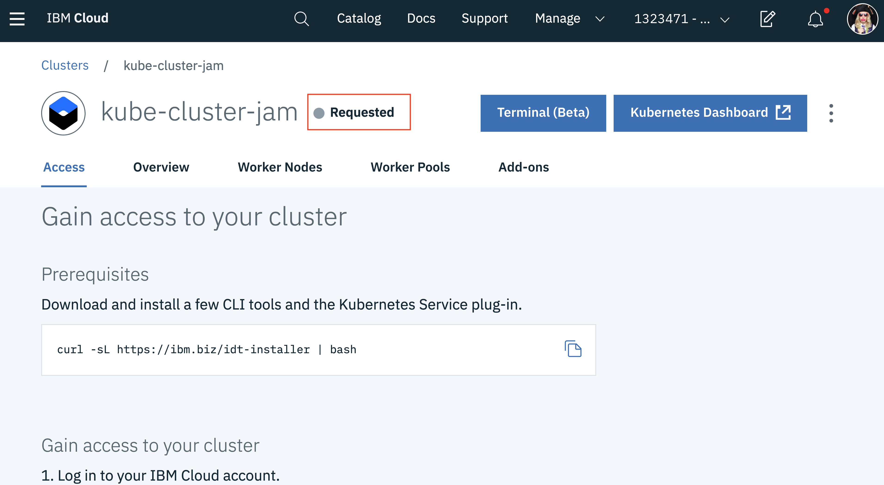

# Getting Started with Machine Learning for the Developer
### _Industralizing Data Science and Machine Learning_

Machine Learning, and Data Science have been hot topics for the past 10 years, but what does it mean to the *developer*? 
- Where does one get started?
- How do you transform data into insights?
- What does a Machine Learning model look like?
- How do you share the insights of a model with the world?

## Objective
Over the course of the next several hours you will work through 3 open source examples to bring your practical knowlege of machine learning and its applications up to todays best practices.

## Target Audience
- Developers interested in Machine Learning with little or no practical experience with the topic
- Developers that want to have complete code examples to showcase understanding of Machine Learning, and how to integrate insights into applications.
- Developers that are too busy and need to use and apply best practices around Machine Learning today.

## Outcomes
- Identify and describe how Machine Learning is being used in applications today
- Understand and have example code for training a Supervised Machine Learning Models with SKlearn, Keras, and Tensorflow
- Ability to save trained Machine Learning Models; with example code.
- Understand tools for deploying Machine Learning Models as a Service with an API frontend, through UI, and/or Python SDKs; with example code.
- Basic understanding of Deep Learning, where it's applied, where to find pretrained models, and how to build and deploy a Deep Learning model; with example code
- Links to relevant developer resources 

## Requirements
* [IBM Cloud Account](https://cloud.ibm.com)
* [Kubernetes Cluster](#provision-kubernetes-cluster)

## Links 
* [IBM Developer](https://developer.ibm.com)
* [Watson Studio Overview](https://dataplatform.cloud.ibm.com/docs/content/wsj/getting-started/overview-ws.html?audience=wdp&context=wdp&linkInPage=true)
* [Watson Machine Learning Python SDK](https://wml-api-pyclient.mybluemix.net/)
* [Watson Studio Video Learning Center](https://www.youtube.com/playlist?list=PLzpeuWUENMK3u3j_hffhNZX3-Jkht3N6V)

## Estimated Time to Complete 
**4 Hours**

# Presentation 
Overview of the Machine Learning and Deep Learning landscape
### [Introduction to Machine Learning and Data Science for the Developer]()

# Labs
- [Lab 0](#provision-kubernetes-cluster) - _Provision Kubernetes Cluster_
- [Lab 1](#Lab-1) - _Turn raw data into insights; build, deploy, and consume a Machine Learning model_
- [Lab 2](#Lab-2) - _Training and deploying Deep Learning models to make predictions as an API web service_
- [Lab 3](#Lab-3) - _Package a Deep learning model into a container, and deploy it to Kubernetes, or run offline_

## Provision Kubernetes Cluster
In **Lab3** you will be deploying an application to a Kubernetes cluster; this takes upto 20 minutes to provision and requires a promo code applied to your IBM Cloud account enabling you to create a cluster without entering any credit card information.  The promo code allows users to create a Free cluster with 2 CPUs, 4 GB RAM, and 1 Worker Node. 

**1. Request Promo Code**

**Goto:** [https://developer.ibm.com/callforcode/featurecode](https://developer.ibm.com/callforcode/featurecode)

> Confirmation Code: `CFCday19`

After requesting and saving the promo code from above, login to [IBM Cloud](https://cloud.ibm.com), select `Manage` from the top menu bar, then `Account`.  Within the account page select the `Account Settings` option and scroll down to enter your feature code retrieved above.

**2. Provision a new Kubernetes Cluster**

Kubernetes is an open-source container orchestration platform for deploying and scaling distributed applications. We're going to deploy an API Web Service hosting a Deep Learning model, and a React Web App consuming the API.

From within IBM Cloud select `Catalog` from the top menu bar, then find `Kubernetes` highlighted at the top of the screen, select it and following the prompts to create a new Free Cluster.  

The cluster will take about 15 mintues to provision but we're not going to use it right away. 

After selecting create you will see information for getting started with Kubernetes and a status of _Requested_, this will move to _Deploying_ and eventually _Normal_.

### Continue onto [Lab 1](#lab-1)
----

## Lab 1
### _Turn raw data into insights; build, deploy, and consume a Machine Learning model_

You’re a busy developer, a data scientist or a user with not much coding experience, and want the fastest path delivering data insights to users, but this requires deep expertise in many technology domains. This end-to-end use-case driven lab walks you through the technologies used to:

- Acquire, clean, and explore data
- Build a predictive machine learning model
- Make predictions
- Host the model on IBM Cloud for consumption
- Integrate the model with your web application

Along the way, you’ll learn about scaling compute and memory on IBM Cloud based on training requirements, IBM’s Watson Machine Learning Service for hosting your trained model on IBM’s Cloud, and Watson Studio, a Cloud-based IDE for data science teams; tools that brings together many open-source technologies built for data science and machine learning.

**By the end of this lab you should be able to:**

- Visualize and clean data
- Build a predictive model within a Jupyter Notebook
- Deploy the model to IBM Watson Machine Learning service
- Access the Machine Learning models through through APIs

**Tools Used**
- Jupyter Notebooks _[(docs)](https://jupyter-notebook.readthedocs.io/en/stable/)_
- Watson Machine Learning _[(docs)](https://dataplatform.cloud.ibm.com/docs/content/wsj/analyze-data/ml-overview.html)_
- Watson Studio _[(docs)](https://dataplatform.cloud.ibm.com/docs/content/wsj/getting-started/welcome-main.html?audience=wdp)_
- Data Refinery [(docs)](https://dataplatform.cloud.ibm.com/docs/content/wsj/refinery/refining_data.html?audience=wdp)
- Apache Spark Environments [(docs)](https://dataplatform.cloud.ibm.com/docs/content/wsj/analyze-data/environments-parent.html?audience=wdp)

**Get Started**

Here we have two options for exploring data, transforming data, training a model, hosting the model as an API web service, and consuming the API. **Part 1A** uses the Automatic Model Building tool in Watson Studio, and allows you to quickly train a supervised Machine Learning model, and evaluate its accuracy without having to write any code, this is an excellent way to prototype.  **Part 1B** does the same as Part1A, you explore data, transform data, train and evaluate a Machine Learning model, and host the model as an API web service before consuming the service, all using Python in a Jupyter Notebook. 

**Choose One**

### [Part 1A - Automatic Model Builder](https://github.com/justinmccoy/lab-watson-automatic-model-builder)
### [Part 1B - Jupyter Notebooks](https://developer.ibm.com/patterns/create-and-deploy-a-scoring-model-to-predict-heartrate-failure/)

**Related Links**
- [Principle Component Analysis Example](https://developer.ibm.com/patterns/deep-dive-into-pca-principal-component-analysis/)
- [Perform Feature Engineering and Model Scoring on Watson Studio Local](https://developer.ibm.com/patterns/model-mgmt-on-watson-studio-local/)
- [Build a customer churn predictor](https://developer.ibm.com/patterns/predict-customer-churn-using-watson-studio-and-jupyter-notebooks/)

## Lab 2
### _Training and deploying Deep Learning models to make predictions as an API web service_
You're familiar with data science and Machine Learning, have built models before, but are trying to understand how to make sense of a large feature space. Deep learning with hyperparameter optimiation is an effective method for identifying and weighting the most important features without the need to manually pick those features.

This lab begins by introducing you to Deep Learning through a Jupyter notebook environment using the Keras framework. The lab in **Part 2** builds on the Jupyter Notebook enviornment by defining and submitting experiments as Python code for training multiple models in parellel.

**By the end of these labs you should be able to:**

- Build a Deep Learning model in a Jupyter Notebook using Keras on timeseries data
- Deploy and consume the trained Deep Learning model as an API on the Watson Machine Learning Service
- Create and submit Deep Learning experiments in parellel for hyperparameter optimization
- Compare Deep Learning training runs for accuracy 

**Tools Used**
- Jupyter Notebooks _[(docs)](https://jupyter-notebook.readthedocs.io/en/stable/)_
- Watson Machine Learning _[(docs)](https://dataplatform.cloud.ibm.com/docs/content/wsj/analyze-data/ml-overview.html)_
- Watson Studio Deep Learning as a Service _[(docs)](https://dataplatform.cloud.ibm.com/docs/content/wsj/analyze-data/ml_dlaas.html?audience=wdp)_
- Keras [(docs)](https://keras.io/)

**Get Started**

This lab is broken into two parts, **Part 1** focus on training a Recurrent Neural Network on Time Series data in a Jupyter Notebook. The dataset used contains only a single feature, but could easily be modified to include hundreds of features or a completely different timeseries dataset. **Part 2** packages up the code seen in Part 1 as a Python application, and configuration file and submits it to Watson's Deep Learning Service to perform hyperparameter optimization, training many versions of the same model with slightly different variations in parallel.

### [Part 1](https://github.com/justinmccoy/timeseries-rnn-lab-part1) - Train a Recurrent Neural Network on a Jupyter Notebook in Python using Keras
### [Part 2](https://github.com/justinmccoy/timeseries-rnn-lab-part2) - Perform Hyperparameter Optimization; train and host a Deep Learning model as a API web service

**Related Links**
- [AI Research @IBM](https://www.research.ibm.com/artificial-intelligence/)
- [Monitor Machine Learning Models with OpenScale](https://developer.ibm.com/patterns/monitor-custom-machine-learning-engine-with-ai-openscale/)
- [Refine your Deep Learning Model](https://developer.ibm.com/articles/image-recognition-challenge-with-tensorflow-and-keras-pt2/)

## Lab 3
### _Package a Deep learning model into a container, and deploy it to Kubernetes, or run offline_
You want to learn how to package a deep learning model, consume it from an application, run it offline as a API endpoint, or deploy the model to Kubernetes.

*By the end of these labs you should be able to:*

- Find existing Deep Learning and Machine Learning models to solve common problem spaces
- Deploy packaged Deep Learning models to a Kubernetes Service
- Wrap a existing Deep Learning or Machine Learning Model as a web API
- Package a trained Deep Learning or Machine Learning model in a container

- Deploy the trained De

### Get Started
### [Part 1]() - Package and Deploy a Deep Learning Model in a Container on Kubernetes
### [Part 2]() - Consume the Deep Learning Model with a NodeJS application 

## Suggested Reading
- Website
- Podcast
- Developer
